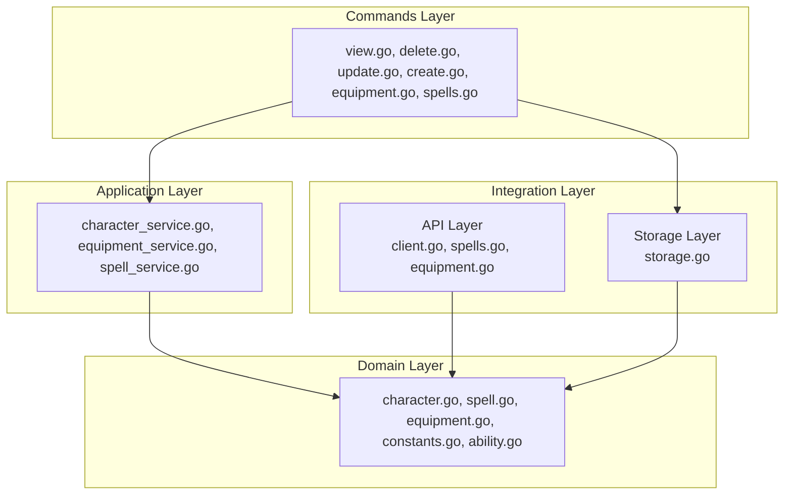
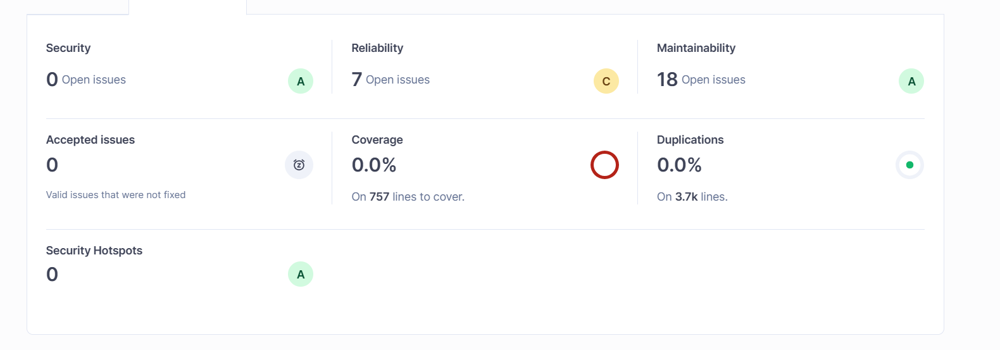
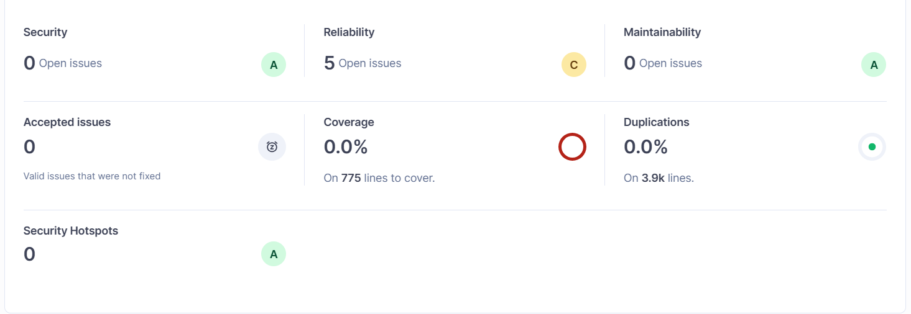

# Exam Report – Modern Programming Practices

## Architecture (Extensibility) 

Omdat ik nog best veel moeite heb gestoken in de Architecture wil ik dit even kort toelichten in dit rapport.

### Voorbeelden waarom de code goed is

- De CLI-functionaliteit en server-functionaliteit staan in aparte `main.go` bestanden (`main.go` voor CLI en `server/main.go` voor server), waardoor ze onafhankelijk functioneren.  
- De commands en berekeningen (skills, combat stats, spellcasting, weapon damage) staan in eigen methodes of mappen, waardoor de logica modulair is.  
- De codebase volgt het **Open/Closed Principle**: nieuwe features kunnen toegevoegd worden zonder bestaande code te wijzigen.  

### Opsplitsing van modellen

Het veel te grote bestand `models/character.go` is verwijderd en opgesplitst in **domain** en **application** lagen omdat ik vind dat 1 groot bestand waar alles in staat zowel berekening als structs niet duidelijk is.

**Domain-lagen (`domain/`)**  
- `character.go` – structs voor character data  
- `ability.go` – ability score logica  
- `equipment.go` – weapon, armor en shield structuren  
- `spell.go` – spell structuren  
- `constants.go` – relevante constanten  

**Application-lagen (`application/`)**  
- `character_service.go` – berekeningen op characters (combat stats, initiative, AC)  
- `equipment_service.go` – weapon/armor damage berekeningen  
- `spell_service.go` – spellcasting logica  
- `equipment_service_test.go` – tests voor equipment functionaliteit  

**Voordelen:**  
- Domain bevat enkel data en basale logica.  
- Application bevat alle business logic.  
- Nieuwe features kunnen makkelijk toegevoegd worden in `application` zonder impact op `domain`.  

### API opsplitsing

Oorspronkelijk bestond er één `api.go` bestand. Dit is opgesplitst in:  

- `api/client.go` – centrale API-client en request-logica  
- `api/spell.go` – spells ophalen en enrich-logica  
- `api/equipment.go` – equipment ophalen en enrich-logica  

**Voordelen:**  
- **Single Responsibility Principle**: elke file heeft één duidelijk doel.  
- Wijzigingen in spells of equipment vereisen geen aanpassing van andere API-functionaliteit.  
- `client.go` wordt hergebruikt door `spell.go` en `equipment.go`.  
- Verbeterde modulariteit en testbaarheid.  

### Mermaid diagram voor de samenwerking van de lagen
- Gebruik ctrl + shift + v om de preview te zien!

### Uitleg van de lagen

- **Commands Layer:** bevat alle CLI-functionaliteit en gebruikt Application voor businesslogica en Storage voor directe data-opslag.

- **Application Layer:** Deze laag bevat alle business logic van de applicatie. Hier vindt alle kernverwerking plaats die bepaalt hoe de characters, equipment en spells functioneren binnen het systeem.

- **Domain Layer:** Deze laag definieert alle kernmodellen en constanten van het systeem. Het bevat structuren zoals Character, Weapon, Armor, AbilityScores, en vaste waarden zoals spell levels of ability modifiers.

- **API Layer:** integreert externe data en gebruikt Domain-modellen.

- **Storage Layer:** beheert dataopslag en gebruikt Domain; Commands spreekt Storage direct aan voor praktische redenen.

**Opmerking:** De directe toegang van Commands naar Storage is een bewuste praktische keuze om CLI-operaties eenvoudig en snel te laten verlopen, zonder extra lagen voor eenvoudige read/write-acties. Hierdoor blijft de kernlogica in Application en Domain schoon en onafhankelijk, terwijl de gebruiker via de CLI direct met data kan werken.

## Maintainability 

De code is overzichtelijk en onderhoudbaar, met duidelijke scheiding van verantwoordelijkheden.

### Mappenstructuur
project/
├─ api/ # API calls 
├─ commands/ # CLI commands
├─ data/ # CSV bestanden
├─ domain/ # Structs & basale logica
│ ├─ character.go
│ ├─ ability.go
│ ├─ equipment.go
│ ├─ spell.go
│ └─ constants.go
├─ application/ # Business logic / services
│ ├─ character_service.go
│ ├─ equipment_service.go
│ ├─ spell_service.go
│ └─ equipment_service_test.go
├─ server/
│ ├─ main.go
│ └─ character.json
├─ static/ # CSS, JS, images
├─ templates/ # HTML templates
├─ main.go # CLI entrypoint
└─ character.json # CLI-specifieke opslag

- Wijzigingen in bijvoorbeeld `api/` of `domain/` hebben geen impact op `commands/` of `server/`.  
- De functies doen telkens één duidelijk ding, hebben duidelijke namen en laten belangrijke acties of fouten zien in de logs. Dit maakt het makkelijker om de code later te begrijpen en aan te passen.

### Functie-indeling

- Elke functie heeft één duidelijke verantwoordelijkheid voorbeelden:  
  - `CalculateArmorClass()` – berekent alleen AC  
  - `SetupSpellcasting()` – regelt spellcasting  
  - `WeaponDamage()` – berekent damage van een wapen  
- Cyclomatic complexity is laag (<10 per functie), wat testen en debuggen vereenvoudigt.    

---
## SonarQube als bewijs
Om te controleren hoe goed mijn code is op het gebied van maintainability heb ik gebruik gemaakt van SonarQube.
SonarQube analyseert de code automatisch op maintainability issues, zoals:
- Te lange functies of te veel logica in één plek.  
- Onnodige duplicatie.  
- Slecht benoemde identifiers.  

### Screenshots
1. **Eerste afbeelding:**  
     
   Hier zijn nog enkele maintainability issues zichtbaar. Deze issues gaan vooral over enorme functies, en herhalingen van stukken code.

2. **Tweede afbeelding:**  
     
   Alle issues zijn opgelost en de maintainability score is verbeterd naar bijna 0 issues.  

---

## Concreet bewijs van kwaliteit
Ik had veel issues door te lange functies en code dupplicatie. 
Voorbeelden:
- Functies zoals `GenerateSpellSlots`, `SetupSpellcasting` en `GiveStartingSpells` zijn opgesplitst per verantwoordelijkheid.  
- Full casters, half casters en warlocks hebben hun eigen generatorfuncties, wat duplicatie voorkomt en aanpassingen makkelijker maakt.  
- CSV parsing, spell lookup en karakterlogica zijn duidelijk gescheiden.  

## Testing 

Weapon damage-functionaliteit is volledig getest met **geautomatiseerde tests**, inclusief happy path en edge cases.

### OUTPUT TESTS

PS C:\Users\julia\DnD character sheet generator> go test ./application -v                                                                    
>> 
=== RUN   TestCalculateWeaponDamage
=== RUN   TestCalculateWeaponDamage/Level_1_Half-Orc_Barbarian_with_Greataxe
=== RUN   TestCalculateWeaponDamage/Level_1_Tiefling_Ranger_with_Shortsword
=== RUN   TestCalculateWeaponDamage/Level_1_Dwarf_Rogue_with_Rapier
--- PASS: TestCalculateWeaponDamage (0.00s)
    --- PASS: TestCalculateWeaponDamage/Level_1_Half-Orc_Barbarian_with_Greataxe (0.00s)
    --- PASS: TestCalculateWeaponDamage/Level_1_Tiefling_Ranger_with_Shortsword (0.00s)
    --- PASS: TestCalculateWeaponDamage/Level_1_Dwarf_Rogue_with_Rapier (0.00s)
=== RUN   TestCalculateWeaponDamage_EdgeCases
=== RUN   TestCalculateWeaponDamage_EdgeCases/Negative_STR_and_DEX
=== RUN   TestCalculateWeaponDamage_EdgeCases/Zero_modifiers
--- PASS: TestCalculateWeaponDamage_EdgeCases (0.00s)
    --- PASS: TestCalculateWeaponDamage_EdgeCases/Negative_STR_and_DEX (0.00s)
    --- PASS: TestCalculateWeaponDamage_EdgeCases/Zero_modifiers (0.00s)
PASS
ok      dnd-character-sheet/application (cached)

### Argumentatie 

Tests zijn aanwezig en uitgevoerd via `go test ./application -v`.

**Happy path**  
De functionaliteit werkt correct voor voorbeeldkarakters:  

- Half-Orc Barbarian met Greataxe → `1d12 +3`  
- Tiefling Ranger met Shortsword → `1d6 +2`  
- Dwarf Rogue met Rapier → `1d8 +2`  

Dit bewijst dat de hoofdfunctionaliteit correct wordt uitgevoerd.

**Edge cases / combination of manual and automated tests**  
Edge cases zijn getest:  

- Negatieve modifiers (bijv. DEX/STR < 0) → correcte berekening (`-1`)  
- Zero modifiers → correcte berekening (`+0`)  

**Conclusie**  
- De tests dekken zowel **happy path** als belangrijke randgevallen.  
- De geautomatiseerde tests zijn volledig succesvol uitgevoerd.  
- Hierdoor is aangetoond dat de weapon damage-functionaliteit correct, betrouwbaar en uitbreidbaar is.

### Handmatige tests en interactie

De applicatie ondersteunt zowel **CLI**- als **server-gebaseerde interactie** met characters.  

#### Server (localhost)
- Wanneer de server wordt gedraaid (`server/main.go`), kunnen via de **character sheet** nieuwe characters worden aangemaakt.  
- Deze characters worden opgeslagen in het bestand `character.json` dat zich bevindt in de **server/** map.  
- Alle gemaakte characters kunnen worden bekeken via de character sheet interface.  

#### CLI
- Via de **CLI** kunnen characters worden aangemaakt met het `create`-commando.  
- Characters kunnen worden **enriched** met het `enrich`-commando, waarbij onder andere weapon stats, spells en equipment worden opgehaald uit de API.  
- De CLI slaat alle aangemaakte en enriched characters op in het bestand `character.json` in de **root folder**.  

 In beide `character.json` bestanden (server en root) staan alle gemaakte characters overzichtelijk opgeslagen en kunnen deze bekeken worden.  

### Voorbeelden handmatige tests – CLI

 **Test 1 – Character aanmaken**
  go run main.go create -name "Elyra" -class "bard" -race "half-elf" -level 2 -str 10 -dex 16 -con 12 -int 13 -wis 11 -cha 15

**Test 2 – Eventueel wapen toevoegen**
  go run main.go equip -name Elyra -weapon shortsword

**Test 3 – API gebruiken om character te verreiken**
  go run main.go enrich -name Elyra

Op deze manier kunnen characters worden gemaakt en verreikt door middel van de API.
